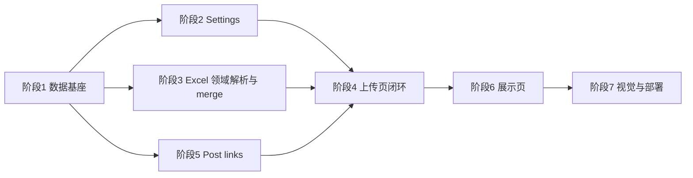

# Caser 小红书数据看板 — 剩余任务列表（对齐 PRD）

**当前状态（一行）**：**阶段 1–5 已落地**（含 Post links：`GET /api/notes`、`PATCH /api/notes/:id`、同页筛选与保存/清空）；下一步为阶段 6（公开展示页 `/`）。

---

## 阶段总览与依赖顺序

- **阶段 5** 依赖 **阶段 1**（`Note` 需有库表）；可与阶段 3 并行开发，但 **上传页整合** 建议在阶段 4 一并验收 Post links。
- **阶段 6** 依赖 **阶段 1 + 2**（至少能读 Settings；读 Note / AccountDaily 视阶段 3 进度而定）。

---

## 阶段 1 — 数据基座（PostgreSQL + Prisma）✅ 已落地

**阶段目标**：建立与 PRD 逻辑模型一致的持久化层，后续 API 与页面只通过 `lib/db` 访问数据。

**任务条目**

1. 初始化 Prisma，配置 `DATABASE_URL`（本地 `.env.local`，**勿提交密钥**）。
2. 设计并实现首版 schema（与 PRD 对齐，可迭代）：
  - `Note`：合并键 `title` + `publishedDate`（精确到日）；业务列 + 可空 `postUrl`。
  - `AccountDaily`：按日序列（`date` + `metricKey` + `value` 等简单可查询形态，或等价 JSONB，二选一并在注释中说明）。
  - `Settings`：单行或键值，含 `followers`、`totalPosts`、`likesAndSaves`、`launchDate`（默认 `2025-06-15`）。
3. 首版 migration 可应用；提供最小 seed 或文档说明如何插入默认 Settings（可选）。
4. `lib/db`：导出 Prisma Client 封装（单例），供 Route Handler / Server Actions 使用。

**依赖**：无（项目起点）。

**验收标准**

- `npx prisma migrate dev`（或等价）在干净库上可成功执行。
- 应用内任意服务端代码可通过封装查询/写入上述表（可用临时脚本或单测验证）。
- 仓库内无硬编码 `DATABASE_URL` / `UPLOAD_SECRET`。

**落地说明**：`prisma/schema.prisma` 定义 `Note` / `AccountDaily` / `Settings`；`prisma/migrations/20250405061530_init` 为初版 SQL；`lib/db` 导出单例 `prisma`；`.env.example` 列出 `DATABASE_URL`。本地：在 `**.env.local`**（或 `.env`）中设置 `DATABASE_URL`；`npm run db:*` 已通过 **dotenv-cli `-c development`** 加载与 Next 相同的 env 文件，避免「只配了 `.env.local` 而 Prisma 读不到」的问题。然后执行 `npm run db:migrate`，再 `npm run db:seed`。

---

## 阶段 2 — Settings API 与手填 KPI 落库 ✅ 已落地

**阶段目标**：手填宏观 KPI 与 `launchDate` 以库内为准，满足 PRD「展示页顶部以手填为准」的数据来源。

**任务条目**

1. 实现 `PUT /api/settings`：`Authorization: Bearer <UPLOAD_SECRET>`；Body 更新 `followers`、`totalPosts`、`likesAndSaves`、`launchDate`（字段与 PRD 一致）；错误返回 **401**（无泄露细节）。
2. 实现 `GET /api/settings`：供上传页预填；若展示页全部 Server 直读 DB，此接口可设为**需密钥**或**公开只读**（与 PRD「二选一」一致，在代码注释中固定一种并写清）。
3. `/upload` 页面：加载时拉取 Settings 预填三个数字框 + `launchDate`（若本页展示）；保存按钮或「与上传一并保存」策略与阶段 4 协调（至少有一种方式能 **PUT 成功并刷新显示**）。

**依赖**：阶段 1。

**验收标准**

- 无密钥访问 `PUT` → 401；正确密钥 → 200 且库内字段更新。
- 刷新上传页后手填字段与库内一致（对 `GET` 方案而言）。

---

## 阶段 3 — Excel 领域解析、`lib/merge` 与 `POST /api/upload` ✅ 已落地

**阶段目标**：从「全表原始网格」升级为 PRD 约定的**按中文 Sheet/列路由**的解析器，并对 Note / AccountDaily 做 **upsert** 与 **merge 预览统计**。

**任务条目**

1. `**lib/excel`**：在现有通用解析之上，增加按 **中文 Sheet 名 + 表头** 识别的解析器（PRD「Excel 与 Sheet 范围」）；约定：
  - 笔记列表明细：**跳过第 1 行说明、第 2 行表头**，数据自第 3 行起。
  - 中文日期解析并归一到**日**（如 `2026年03月16日08时00分29秒`）。
2. `**lib/merge`**：Note / AccountDaily 的 upsert；计算 **新增 / 更新 / 未触碰** 条数（与 PRD 合并原则一致：未出现键保留，出现键新覆盖）。
3. `**POST /api/upload`**：`multipart/form-data`，`files[]` 多 xlsx；**Node runtime**；校验 `UPLOAD_SECRET`；可选同请求携带手填 KPI（若携带则写 Settings）；响应含 `inserted`、`updated`、`untouched` 及必要摘要；限制文件类型与大小（防滥用）。
4. 与现有 `POST /api/excel/parse` 的关系：明确保留为「仅预览」或合并进 upload（二选一，在代码/README 注一句）。

**依赖**：阶段 1（必须有表才能 upsert）。

**验收标准**

- 用官方样例结构 xlsx（或脱敏副本）上传后，库内 Note/AccountDaily 行符合预期键与字段。
- 响应 JSON 中 **inserted / updated / untouched** 与对同一文件的重复上传行为可解释（第二次应以 update 为主等）。
- 全程无 Edge 解析 xlsx。

---

## 阶段 4 — 上传页功能闭环（仍可无样式）✅ 已落地

**阶段目标**：`/upload` 满足 PRD 第 2 条核心能力：多文件、真实合并入库、merge 预览、手填覆盖 Settings；**仍不出现在公开展示导航**。

**任务条目**

1. 多文件上传走 `**POST /api/upload`**（或等价单次 multipart 多 `files[]`），与 PRD 接口定义一致。
2. 页面上展示 **merge 预览**（新增/更新/未触碰），不仅展示原始 JSON 网格（可保留调试用区块或折叠）。
3. 手填 KPI + `launchDate` 与 **PUT /api/settings** 或 upload 请求内联保存，行为与文案统一为英文 UI。
4. （可选本阶段）文件拖放区域，不改变「无样式」也可用最简 `border` 表示拖放区。

**依赖**：阶段 2、阶段 3。

**验收标准**

- 运营流程：选多个 xlsx → 上传 → 看到统计 → 改 KPI → 保存 → 再打开页数据仍在。
- 无密钥无法完成上传或改设置。

**落地说明**：`app/upload/page.tsx`：`FormData` 使用 `files[]` + `Authorization: Bearer` 调用 `POST /api/upload`；展示总体与 `notes` / `accountDaily` 分项 merge 统计及 `summary` / `warnings` / `errors`；手填 KPI 仍用 `PUT /api/settings`，可选勾选「Save KPI fields with this upload」在同请求以表单字段写入 Settings（与 `lib/settings/formKpi.ts` 一致）；`
` 内保留 `POST /api/excel/parse` 仅预览；简易拖放区与英文 UI。

---

## 阶段 5 — Post links（同页区块 + API）✅ 已落地

**阶段目标**：PRD 第 3 条：按标题关键词与日期范围筛选笔记，手动粘贴 URL 保存/清空；无批量映射表。

**任务条目**

1. `GET /api/notes`：密钥；Query：`q`、`year`、`from`/`to`、分页。
2. `PATCH /api/notes/:id`：密钥；Body `{ postUrl: string | null }`；校验 `http(s):`。
3. `/upload` 同页增加 **Post links** 区块：列表 + 筛选 + 输入 URL + Save / Clear。

**依赖**：阶段 1（`Note` 表）；与阶段 4 同一页面整合。

**验收标准**

- 能搜到已入库笔记，保存 URL 后库内更新；`postUrl` 清空合法。
- 错误 URL 被拒绝；401 行为正确。

**落地说明**：`app/api/notes/route.ts`（`page` / `limit`，`limit`≤100）、`app/api/notes/[id]/route.ts`；`lib/notes/postUrl.ts` 仅允许 `http:` / `https:`；`/upload` 内 Post links 表格与筛选（Search 应用条件、分页 Previous/Next）。

---

## 阶段 6 — 公开展示页 `/`

**阶段目标**：PRD 第 1 条：英文 UI、Logo、KPI、粉丝曲线与近 30 日逻辑、爆发日提示、细分图、Top 10 by views、年份筛选、标题原样、`View post` 仅当有 URL。

**任务条目**

1. 路由结构：`app/(public)/page.tsx`（或等价），数据以 **Server Component 直读 DB** 为主。
2. KPI：`followers`、`totalPosts`、`likesAndSaves`、`Days since launch`（`launchDate` 默认 `2025-06-15`）；**以 Settings 手填为准**。
3. 图表：**Recharts**（或 PRD 指定单一库）；粉丝曲线与窗口对齐规则按 PRD 实现。
4. Top 10、年份筛选、外链 `rel="noopener noreferrer"`。
5. **首页导航不出现 `/upload` 入口**（PRD 明确）。

**依赖**：阶段 1、2；Note/AccountDaily 数据依赖阶段 3 的实际上线内容。

**验收标准**

- 未登录访客可打开 `/` 看到与库一致的宏观数据与图表（在无敏感数据环境下演示通过）。
- 上传页 URL 需自行收藏，公开展示无链至 upload。

---

## 阶段 7 — 品牌视觉、资源与部署

**阶段目标**：对齐 `references/color-purple.md` 与 Logo；可部署 Vercel。

**任务条目**

1. 主题：紫色 token（Tailwind/CSS 变量等），避免无关高饱和跳色；图表色与紫系协调。
2. Logo：`assests/caser-logo-01.png` → 运行引用路径与 PRD 一致（如构建时复制到 `public/` 并在文档说明）。
3. 环境变量与生产数据库、密钥配置文档（不含真实值）。
4. （可选）解决 Windows 上 `next build` 偶发 `spawn UNKNOWN` 等环境问题，保证 CI/部署可稳定 build。

**依赖**：阶段 6（展示页）与阶段 4（上传页）功能稳定后再统一上样式，可减少返工。

**验收标准**

- 主要页面视觉与色板文档一致；Logo 展示正确。
- 生产环境可完成一次端到端：上传 → 库更新 → `/` 反映变化。

---

## 维护说明

- 任务完成或范围变更时，**更新本文顶部「当前状态」一行**与相关阶段勾选/备注即可。
- 产品优先级以 [PRD.md](./PRD.md) 为准；冲突时先改 PRD 再改代码（与 `.cursor/rules/project.mdc` 一致）。

